# Phân Tích Dự Án: Uniswap V3 REVM Arbitrage

## Tổng Quan Dự Án

Dự án này là một hệ thống tính toán cơ hội arbitrage MEV (Maximal Extractable Value) trên Uniswap V3 sử dụng REVM (Rust Ethereum Virtual Machine). Dự án so sánh hiệu suất giữa eth_call truyền thống và REVM simulation để tìm kiếm cơ hội arbitrage giữa các liquidity pools.

---

## 1. Kiến Trúc Tổng Thể

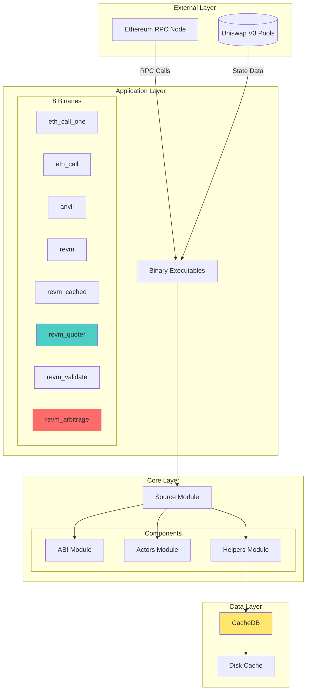

---

## 2. Luồng Dữ Liệu Chính - Main Data Flow

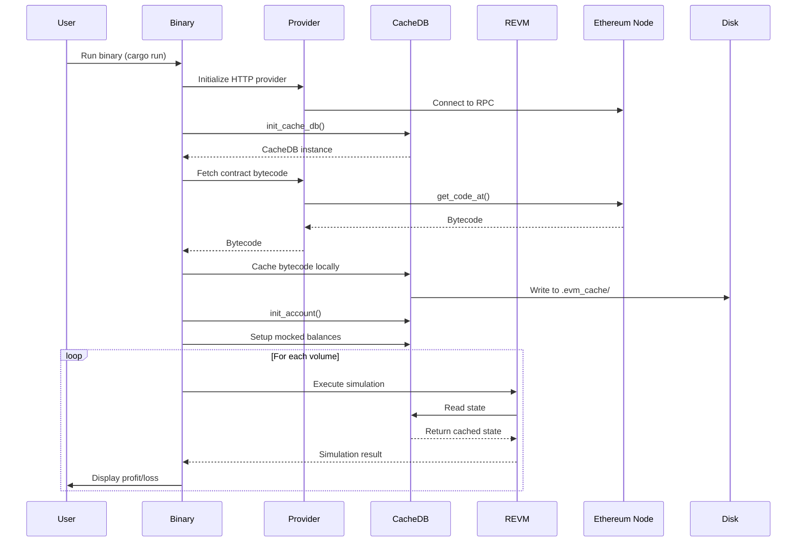

---

## 3. Luồng Chi Tiết: Arbitrage Detection Flow

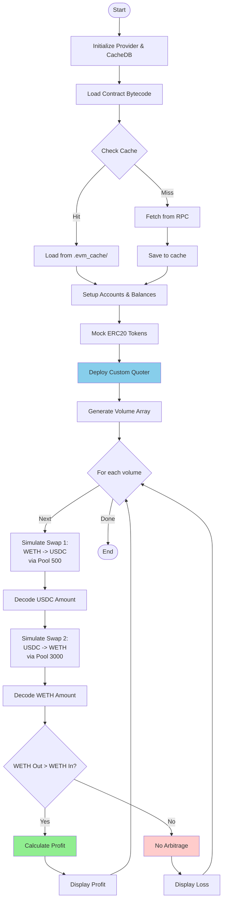

---

## 4. Các Module Chính - Core Modules

### 4.1 Source Module Structure

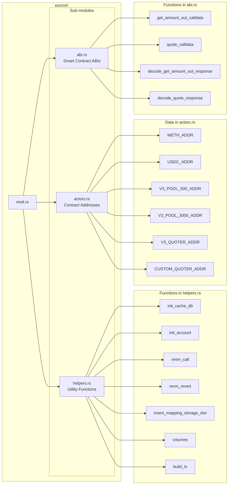

---

## 5. So Sánh Các Binary Executables

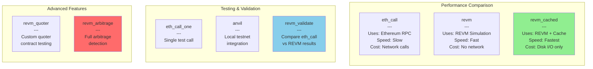

---

## 6. Luồng Xử Lý REVM Simulation

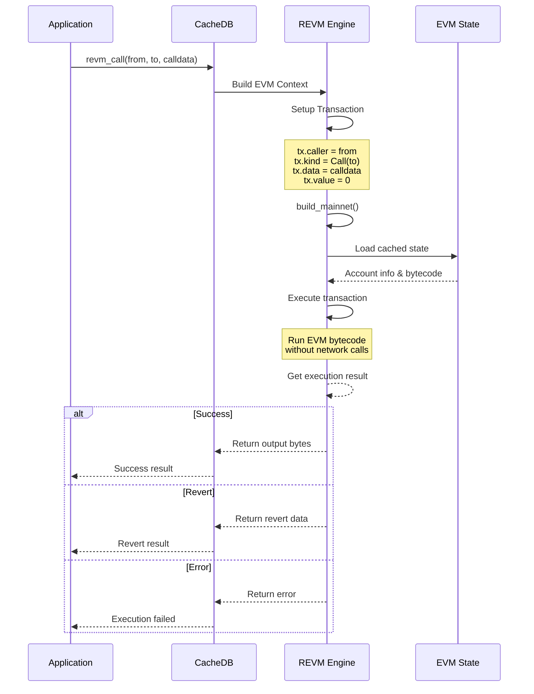

---

## 7. Chi Tiết: Arbitrage Calculation Logic

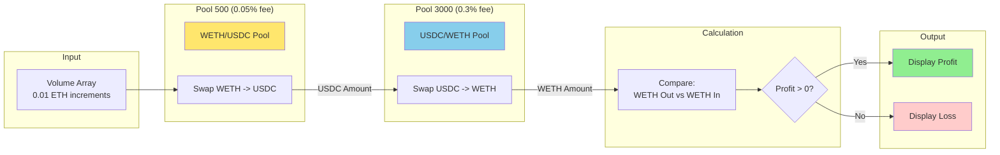

---

## 8. Caching Strategy

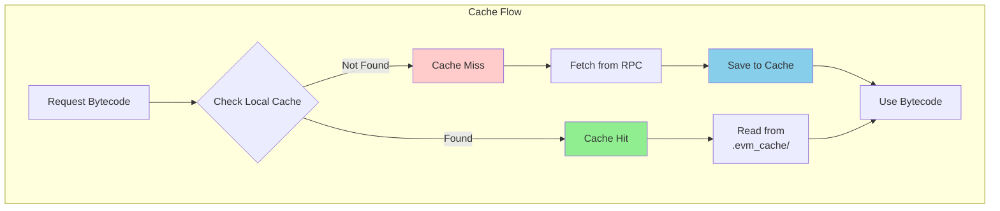

**Cache Key Format**: `bytecode-{address}`

**Cache Location**: `.evm_cache/`

**Benefit**: Giảm số lượng RPC calls, tăng tốc độ thực thi đáng kể

---

## 9. State Mocking Strategy

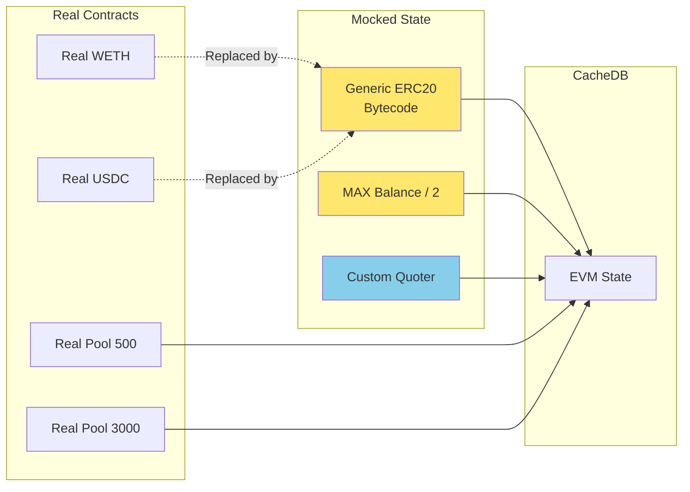

**Lý do Mock**:
- ERC20 tokens: Đảm bảo có đủ balance để test
- Pools: Giữ nguyên logic thực của Uniswap V3
- Custom Quoter: Deploy contract tùy chỉnh để tính toán hiệu quả hơn

---

## 10. Dependencies & Tech Stack

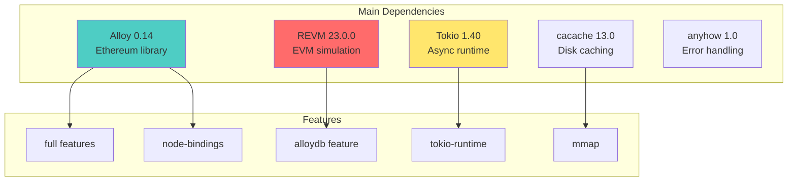

---

## 11. Performance Metrics

### Benchmark Comparison

| Method | Speed | Network Cost | Use Case |
|--------|-------|--------------|----------|
| **eth_call** | Slow (100-500ms/call) | High | Production validation |
| **revm** | Fast (1-5ms/call) | Low (initial fetch) | Development testing |
| **revm_cached** | Fastest (<1ms/call) | None (after cache) | High-frequency simulation |

### Volume Testing Strategy

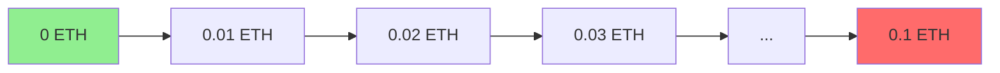

**Volume Generation**: `volumes(U256::ZERO, ONE_ETHER / 10, 100)`
- From: 0 ETH
- To: 0.1 ETH
- Steps: 100 increments

---

## 12. Key Addresses (Ethereum Mainnet)

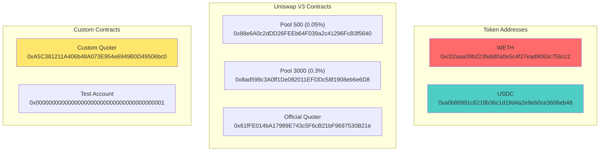

---

## 13. Execution Examples

### Example 1: Run Arbitrage Detection

```bash
source .env && cargo run --bin revm_arbitrage --release
```

**Output**:
```
100000000000000000 WETH -> USDC 372506163498 -> WETH 99518267727624337
100000000000000000 WETH -> USDC 372506163498 -> WETH 99518267727624337
No profit.
```

### Example 2: Run Performance Comparison

```bash
source .env && cargo run --bin revm_validate --release
```

**Output**:
```
10000000000000000 WETH -> USDC REVM 37250616349 ETH_CALL 37250616349
20000000000000000 WETH -> USDC REVM 74501232698 ETH_CALL 74501232698
✓ All results match
```

---

## 14. Error Handling & Edge Cases

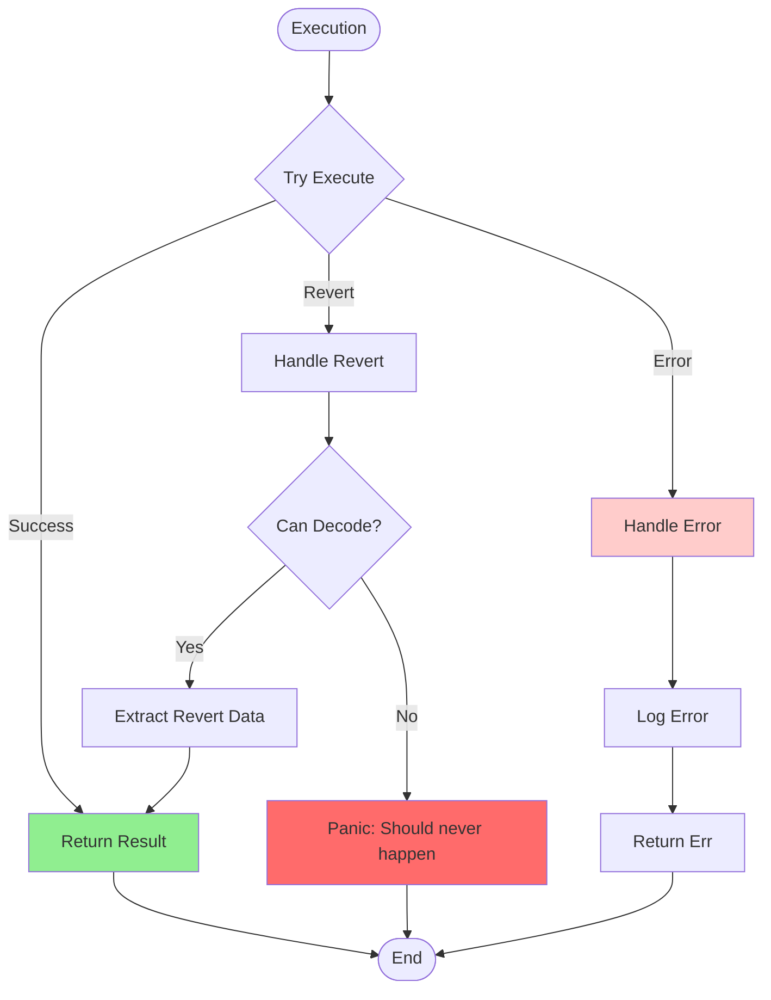

---

## 15. Future Improvements

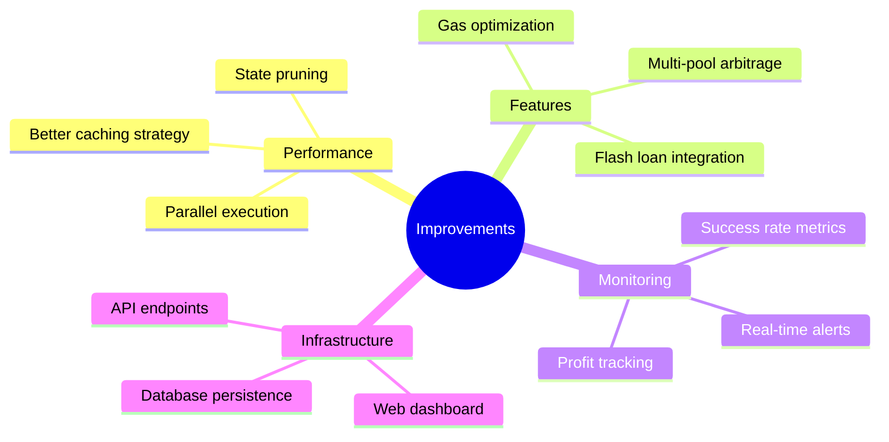

---

## Kết Luận

Dự án này là một ví dụ xuất sắc về việc sử dụng REVM để:

1. **Tăng tốc độ**: Giảm thời gian thực thi từ hàng trăm ms xuống còn <1ms
2. **Giảm chi phí**: Loại bỏ network calls sau lần đầu tiên
3. **Tăng độ chính xác**: So sánh kết quả giữa eth_call và REVM để đảm bảo tính đúng đắn
4. **Dễ dàng test**: Có thể mock state và test nhiều scenarios nhanh chóng

### Tech Stack Summary

- **Language**: Rust 1.83.0
- **EVM Simulation**: REVM 23.0.0
- **Ethereum Library**: Alloy 0.14
- **Async Runtime**: Tokio 1.40
- **Caching**: cacache 13.0

### Key Files

- `src/revm_arbitrage.rs` - Main arbitrage logic
- `src/source/helpers.rs` - Core utility functions
- `src/source/actors.rs` - Contract addresses
- `src/source/abi.rs` - ABI encoding/decoding
