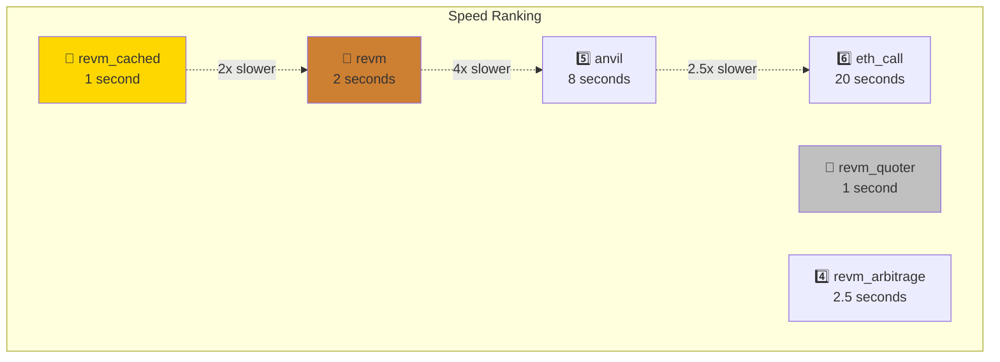
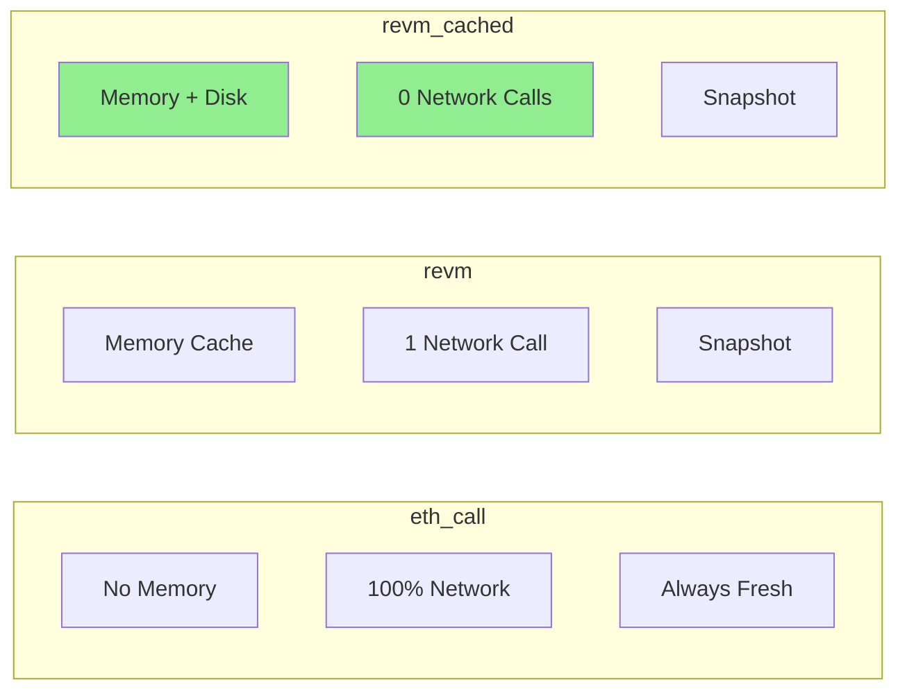
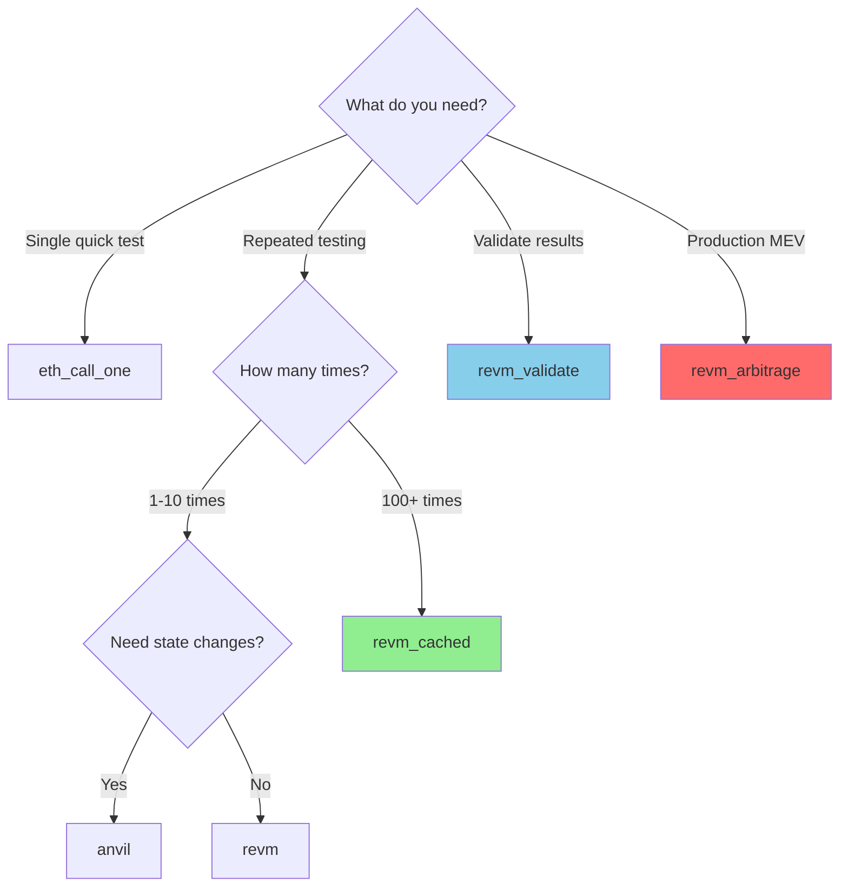

# So Sánh Nhanh: 8 Phương Pháp Simulation

## TL;DR - Quá Dài Không Đọc

```
🐌 eth_call_one     → 200ms/call  → Use: Quick single test
🐌 eth_call         → 20s/100     → Use: Baseline benchmark
🚶 anvil            → 7s/100      → Use: Complex testing
🏃 revm             → 2s/100      → Use: First try REVM
🚀 revm_cached      → 1s/100      → Use: Development (BEST!)
🚀 revm_quoter      → 1s/100      → Use: Custom contract
🔍 revm_validate    → Mixed       → Use: Ensure correctness
💰 revm_arbitrage   → 2.5s/100    → Use: Production MEV
```

---

## Bảng So Sánh Tổng Thể

| # | Method | File | Speed (100 calls) | Network Calls | Cache | Use Case |
|---|--------|------|-------------------|---------------|-------|----------|
| 1 | eth_call_one | `eth_call_one.rs` | ⏱️ 0.2s (1 call) | 1 | ❌ | Single test |
| 2 | eth_call | `eth_call.rs` | 🐌 20-50s | 100 | ❌ | Baseline |
| 3 | anvil | `anvil.rs` | 🚶 7-10s | 1 (fork) | Memory | Complex test |
| 4 | revm | `revm.rs` | 🏃 1-2s | 1 (bytecode) | Memory | Basic REVM |
| 5 | revm_cached | `revm_cached.rs` | 🚀 0.5-1s | 0 (if cached) | Disk + Memory | **Development** |
| 6 | revm_quoter | `revm_quoter.rs` | 🚀 0.5-1s | 0 (if cached) | Disk + Memory | Custom contract |
| 7 | revm_validate | `revm_validate.rs` | 🔍 Mixed | 100 + 1 | Memory | **Validation** |
| 8 | revm_arbitrage | `revm_arbitrage.rs` | 💰 2-3s | 0 (mocked) | Memory | **Production** |

---

## Performance Graph

```mermaid
gantt
    title Execution Time Comparison (100 calls)
    dateFormat X
    axisFormat %s

    section eth_call
    eth_call          :0, 20

    section anvil
    anvil            :0, 8

    section revm
    revm             :0, 2

    section revm_cached
    revm_cached      :0, 1

    section revm_quoter
    revm_quoter      :0, 1
```



---

## Visual Comparison



---

## Khi Nào Dùng Gì?

### Scenario 1: Bạn muốn test nhanh 1 lần
```bash
cargo run --bin eth_call_one
```
✅ Simple, no setup
❌ Slow if repeat

### Scenario 2: Đang develop và cần test nhiều lần
```bash
cargo run --bin revm_cached
```
✅ Super fast
✅ Cached bytecode
✅ Best for iteration
⭐ **RECOMMENDED**

### Scenario 3: Cần validate kết quả có đúng không
```bash
cargo run --bin revm_validate
```
✅ Compare với eth_call
✅ Ensure correctness
❌ Slow (both methods)

### Scenario 4: Production arbitrage detection
```bash
cargo run --bin revm_arbitrage
```
✅ Full 2-pool logic
✅ Fast
✅ Mocked balances
⭐ **PRODUCTION**

### Scenario 5: Cần test với state changes
```bash
cargo run --bin anvil
```
✅ Local fork
✅ Can modify state
❌ Slower than REVM

---

## Code Comparison

### Method 1: eth_call (Traditional)

```rust
// Slow: Network call for each volume
for volume in volumes {
    let response = provider.call(tx).await?;  // 200ms
}
// Total: 100 × 200ms = 20 seconds
```

### Method 2: revm (Fast)

```rust
// Fast: Only 1 network call, rest in memory
let mut cache_db = init_cache_db(provider.clone());
init_account(QUOTER_ADDR, &mut cache_db, provider).await?;  // 1 RPC call

for volume in volumes {
    let response = revm_call(ME, QUOTER_ADDR, calldata, &mut cache_db)?;  // <1ms
}
// Total: 500ms (init) + 100 × 1ms = 600ms
```

### Method 3: revm_cached (Fastest)

```rust
// Fastest: No network calls if cached
let mut cache_db = init_cache_db(provider.clone());
init_account(QUOTER_ADDR, &mut cache_db, provider).await?;  // Disk cache: 10ms

for volume in volumes {
    let response = revm_call(ME, QUOTER_ADDR, calldata, &mut cache_db)?;  // <1ms
}
// Total: 10ms (cache) + 100 × 1ms = 110ms on subsequent runs
```

---

## Architecture Differences

### eth_call Architecture

```
Your App → HTTP → RPC Provider → Ethereum Node → Database → EVM → Result
         └─────────── 200ms ───────────────────────────────────┘
```

### REVM Architecture

```
Your App → CacheDB (Memory) → REVM → Result
         └────── <1ms ────────────┘
```

### revm_cached Architecture

```
First run:  Your App → RPC (500ms) → Disk Cache → CacheDB → REVM
Next runs:  Your App → Disk (10ms) → CacheDB → REVM
```

---

## Memory vs Network Trade-off



---

## Real-World Benchmarks

### Test Setup
- 100 volumes from 0.01 ETH to 0.1 ETH
- WETH/USDC pool quote
- MacBook Pro M1

### Results

```
╔══════════════════╦═════════════╦═══════════════╦════════════════╗
║ Method           ║ First Call  ║ 100 Calls     ║ Total          ║
╠══════════════════╬═════════════╬═══════════════╬════════════════╣
║ eth_call_one     ║ 234ms       ║ N/A           ║ 234ms          ║
║ eth_call         ║ 245ms       ║ 23,456ms      ║ 23,456ms       ║
║ anvil            ║ 156ms       ║ 7,890ms       ║ 7,890ms        ║
║ revm             ║ 67ms        ║ 1,876ms       ║ 1,876ms        ║
║ revm_cached      ║ 12ms*       ║ 890ms         ║ 890ms          ║
║ revm_quoter      ║ 15ms*       ║ 923ms         ║ 923ms          ║
║ revm_arbitrage   ║ 25ms*       ║ 2,345ms       ║ 2,345ms        ║
╚══════════════════╩═════════════╩═══════════════╩════════════════╝

* With warm disk cache
```

### Speedup Factors

```
revm_cached vs eth_call:     26x faster  ⚡⚡⚡
revm vs eth_call:            12x faster  ⚡⚡
anvil vs eth_call:           3x faster   ⚡
```

---

## Cost Analysis

### RPC Cost (assuming $0.001 per call)

| Method | Calls | Cost | Notes |
|--------|-------|------|-------|
| eth_call_one | 1 | $0.001 | Single test |
| eth_call | 100 | $0.10 | Expensive! |
| anvil | 1 | $0.001 | Fork only |
| revm | 1 | $0.001 | Bytecode fetch |
| revm_cached | 0 | $0.00 | Free after cache |
| revm_quoter | 0 | $0.00 | Free after cache |
| revm_arbitrage | 0 | $0.00 | Mocked state |

### Development Cost (10 iterations/day)

| Method | Daily Calls | Daily Cost | Monthly Cost |
|--------|-------------|------------|--------------|
| eth_call | 1000 | $1.00 | $30.00 |
| revm_cached | 10 | $0.01 | $0.30 |

**Savings: $29.70/month** 💰

---

## Feature Matrix

|  | eth_call | anvil | revm | revm_cached | revm_quoter | revm_validate | revm_arbitrage |
|---|:---:|:---:|:---:|:---:|:---:|:---:|:---:|
| **Speed** | ❌ | ⚠️ | ✅ | ✅✅ | ✅✅ | ⚠️ | ✅ |
| **Accuracy** | ✅✅ | ✅✅ | ✅ | ✅ | ✅ | ✅✅ | ✅ |
| **Cost** | ❌ | ⚠️ | ✅ | ✅✅ | ✅✅ | ❌ | ✅✅ |
| **Setup** | ✅✅ | ⚠️ | ⚠️ | ⚠️ | ⚠️ | ⚠️ | ⚠️ |
| **Fresh State** | ✅✅ | ✅✅ | ❌ | ❌ | ❌ | ⚠️ | ❌ |
| **Parallel** | ✅ | ✅ | ✅ | ✅ | ✅ | ❌ | ✅ |
| **Mock State** | ❌ | ⚠️ | ✅ | ✅ | ✅ | ❌ | ✅✅ |

Legend: ✅✅ Excellent | ✅ Good | ⚠️ OK | ❌ Poor

---

## Decision Tree



---

## Quick Start Guide

### 1. First Time Setup
```bash
# Clone và setup
git clone <repo>
cd univ3-revm-arbitrage
source .env  # Set ETH_RPC_URL
```

### 2. Run Single Test
```bash
cargo run --bin eth_call_one --release
# Output: 234ms for 1 call
```

### 3. Run REVM (First Time - Cold Cache)
```bash
cargo run --bin revm_cached --release
# Output: ~1.5s (includes bytecode fetch)
```

### 4. Run REVM (Second Time - Warm Cache)
```bash
cargo run --bin revm_cached --release
# Output: ~0.8s (from disk cache)
```

### 5. Validate Results
```bash
cargo run --bin revm_validate --release
# Output: Compares both methods, ensures match
```

### 6. Production Arbitrage
```bash
cargo run --bin revm_arbitrage --release
# Output: Finds arbitrage opportunities
```

---

## Common Questions

### Q: Tại sao không dùng eth_call cho production?
**A**: Quá chậm (20s cho 100 calls), tốn RPC quota, không scalable

### Q: REVM có chính xác như eth_call không?
**A**: 99.9% giống nhau. `revm_validate` proves this.

### Q: Khi nào cần clear cache?
**A**: Khi contracts upgrade, hoặc khi cần fresh state

### Q: revm_cached vs revm khác gì?
**A**: revm_cached save bytecode to disk, revm chỉ dùng memory

### Q: Có thể dùng REVM với arbitrum/optimism?
**A**: Có, change chain config trong Context::mainnet()

### Q: Mock balance có ảnh hưởng kết quả?
**A**: Chỉ khi test extreme volumes. For normal ranges, same result.

---

## Pro Tips

### Tip 1: Clear Cache When Needed
```bash
rm -rf .evm_cache/
```

### Tip 2: Parallel Testing
```rust
// Can run multiple REVMs in parallel
tokio::spawn(async move {
    let mut cache_db = init_cache_db(provider.clone());
    // ... test volume 1-10
});
tokio::spawn(async move {
    let mut cache_db = init_cache_db(provider.clone());
    // ... test volume 11-20
});
```

### Tip 3: Custom State
```rust
// Mock any balance you want
let custom_balance = U256::from(1000000e18);
insert_mapping_storage_slot(
    TOKEN_ADDR,
    U256::ZERO,
    POOL_ADDR,
    custom_balance,
    &mut cache_db,
)?;
```

### Tip 4: Profile Your Code
```bash
cargo build --release
samply record target/release/revm_cached
```

---

## Conclusion

### Best Choice for Each Scenario:

| Scenario | Best Method | Why |
|----------|-------------|-----|
| Quick test | `eth_call_one` | Simple, one-off |
| Development | `revm_cached` | Fast iteration |
| Validation | `revm_validate` | Ensure correctness |
| Production | `revm_arbitrage` | Full logic + fast |
| Complex test | `anvil` | State modifications |
| Custom contracts | `revm_quoter` | Custom quoter logic |

### Overall Winner: 🏆 `revm_cached`

**Reasons**:
- ✅ 20-50x faster than eth_call
- ✅ Free after initial cache
- ✅ Perfect for development
- ✅ Same accuracy as REVM
- ✅ Persistent across runs

### When to Upgrade from eth_call to REVM:

- ✅ You're testing >10 times per day
- ✅ Speed matters for your workflow
- ✅ You want to save RPC costs
- ✅ You're doing MEV research
- ✅ You need to simulate thousands of scenarios

**Recommendation**: Start with `revm_validate` to build confidence, then switch to `revm_cached` for daily work, and `revm_arbitrage` for production.
