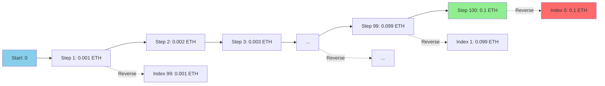

# Giải Thích Chi Tiết: volumes() Function

## Dòng Code Gốc

```rust
let volumes = volumes(U256::ZERO, ONE_ETHER.div(U256::from(10)), 100);
```

---

## TL;DR - Câu Trả Lời Ngắn

**Tạo array 100 volumes test, từ lớn đến nhỏ: [0.1 ETH, 0.099 ETH, ..., 0.001 ETH]**

---

## Phân Tích Từng Phần

### 1. Function Signature

```rust
pub fn volumes(from: U256, to: U256, count: usize) -> Vec<U256>
```

**Parameters:**
- `from`: U256 = Giá trị bắt đầu (dù vậy không dùng, xem bên dưới)
- `to`: U256 = Giá trị kết thúc (max volume)
- `count`: usize = Số lượng volumes cần tạo

**Returns:**
- `Vec<U256>` = Array các volumes để test

---

### 2. Giá Trị Truyền Vào

```rust
volumes(
    U256::ZERO,                              // from = 0
    ONE_ETHER.div(U256::from(10)),          // to = 0.1 ETH
    100                                      // count = 100 volumes
)
```

**Breakdown:**

#### Parameter 1: `U256::ZERO`
```rust
U256::ZERO = 0
```
- Kiểu: U256 (unsigned 256-bit integer)
- Giá trị: 0
- **Chú ý**: Tham số này KHÔNG được sử dụng trong implementation!

#### Parameter 2: `ONE_ETHER.div(U256::from(10))`
```rust
ONE_ETHER = 1_000_000_000_000_000_000  // 10^18 wei = 1 ETH
ONE_ETHER / 10 = 100_000_000_000_000_000  // 10^17 wei = 0.1 ETH
```
- Chia 1 ETH cho 10
- Kết quả: **0.1 ETH** (max volume để test)

#### Parameter 3: `100`
```rust
count = 100
```
- Tạo 100 volumes khác nhau
- Để test nhiều scenarios

---

## 3. Implementation Chi Tiết

```rust
pub fn volumes(from: U256, to: U256, count: usize) -> Vec<U256> {
    // Line 38: Start luôn = 0 (IGNORE tham số from!)
    let start = U256::ZERO;

    // Line 39: Tạo vector rỗng
    let mut volumes = Vec::new();

    // Line 40: Tính khoảng cách từ 'from' đến 'to'
    let distance = to - from;  // 0.1 ETH - 0 = 0.1 ETH

    // Line 41: Chia đều khoảng cách thành 'count' phần
    let step = distance / U256::from(count);  // 0.1 ETH / 100 = 0.001 ETH

    // Line 43-46: Tạo từng volume
    for i in 1..(count + 1) {  // i = 1, 2, 3, ..., 100
        let current = start + step * U256::from(i);
        volumes.push(current);
    }

    // Line 48: ĐẢO NGƯỢC array!
    volumes.reverse();

    // Line 49: Return
    volumes
}
```

---

## 4. Step-by-Step Execution

### Step 1: Calculate Distance & Step

```
from = 0
to = 0.1 ETH = 100,000,000,000,000,000 wei

distance = to - from
         = 0.1 ETH - 0
         = 0.1 ETH
         = 100,000,000,000,000,000 wei

step = distance / count
     = 0.1 ETH / 100
     = 0.001 ETH
     = 1,000,000,000,000,000 wei
```

### Step 2: Generate Volumes (Before Reverse)

```rust
for i in 1..=100:
    current = start + step * i
    volumes.push(current)
```

**Kết quả:**

```
i=1:   0 + 0.001 * 1   = 0.001 ETH
i=2:   0 + 0.001 * 2   = 0.002 ETH
i=3:   0 + 0.001 * 3   = 0.003 ETH
i=4:   0 + 0.001 * 4   = 0.004 ETH
...
i=50:  0 + 0.001 * 50  = 0.05 ETH
...
i=99:  0 + 0.001 * 99  = 0.099 ETH
i=100: 0 + 0.001 * 100 = 0.1 ETH
```

**Array (before reverse):**
```
[0.001, 0.002, 0.003, ..., 0.098, 0.099, 0.1] ETH
```

### Step 3: Reverse Array

```rust
volumes.reverse();
```

**Array (after reverse):**
```
[0.1, 0.099, 0.098, ..., 0.003, 0.002, 0.001] ETH
```

---

## 5. Kết Quả Cuối Cùng

```rust
volumes = [
    100000000000000000,  // 0.1 ETH
    99000000000000000,   // 0.099 ETH
    98000000000000000,   // 0.098 ETH
    97000000000000000,   // 0.097 ETH
    ...
    3000000000000000,    // 0.003 ETH
    2000000000000000,    // 0.002 ETH
    1000000000000000,    // 0.001 ETH
]

Length: 100 volumes
```

---

## 6. Visualization

### Visual Representation



### Chart View

```
Volume Distribution (100 points)

0.1 ETH  ████████████████████████████████  ← Start here (largest)
0.09 ETH ███████████████████████████
0.08 ETH ████████████████████████
0.07 ETH █████████████████████
0.06 ETH ██████████████████
0.05 ETH ███████████████
0.04 ETH ████████████
0.03 ETH █████████
0.02 ETH ██████
0.01 ETH ███
0.001 ETH █                              ← End here (smallest)
```

---

## 7. Tại Sao Lại Làm Như Vậy?

### ❓ Câu Hỏi 1: Tại sao test từ 0.1 ETH xuống 0.001 ETH?

**Lý do**: Large volumes thường profitable hơn (nếu có arbitrage)

```
Logic:
  - Large volumes → Large absolute profit (nếu có %)
  - Test lớn trước → Nếu thấy profit, không cần test nhỏ
  - Optimize: Stop early nếu tìm thấy profitable volume
```

**Example**:
```
Volume      Profit %    Absolute Profit
0.1 ETH     0.5%       = 0.0005 ETH ($1.75)   ✅ Worth it!
0.001 ETH   0.5%       = 0.000005 ETH ($0.02) ❌ Too small
```

### ❓ Câu Hỏi 2: Tại sao 100 volumes?

**Tradeoff**: Resolution vs Speed

```
Too few (10):   Fast but might miss optimal volume
Just right (100): Good balance
Too many (1000): Slow, marginal benefit
```

**Performance**:
```
10 volumes:   ~100ms total
100 volumes:  ~1000ms (1 second)
1000 volumes: ~10 seconds
```

### ❓ Câu Hỏi 3: Tại sao không dùng parameter `from`?

**Bug hoặc Design Choice?**

```rust
// Implementation luôn bắt đầu từ 0
let start = U256::ZERO;  // Ignore parameter 'from'

// Nên là:
// let start = from;
```

**Possible reasons**:
1. **Simplification**: Luôn bắt đầu từ 0 cho đơn giản
2. **Bug**: Developer quên dùng parameter `from`
3. **Design**: Parameter `from` dành cho future use

**Current behavior**:
```rust
volumes(U256::from(100), U256::from(1000), 10)
// Still generates: [1000, 900, 800, ..., 100]
// NOT: [1000, 920, 840, ..., 280, 200, 120]
```

### ❓ Câu Hỏi 4: Tại sao reverse?

**Để test large volumes trước:**

```rust
// Without reverse:
[0.001, 0.002, ..., 0.1]  // Small → Large

// With reverse:
[0.1, 0.099, ..., 0.001]  // Large → Small ✅
```

**Benefit**:
```rust
for volume in volumes {
    if profitable(volume) {
        break;  // Found profitable large volume, stop!
    }
}
// Saves time by testing large first
```

---

## 8. Example Usage in revm_arbitrage.rs

```rust
// Generate 100 volumes from 0.001 to 0.1 ETH
let volumes = volumes(U256::ZERO, ONE_ETHER.div(U256::from(10)), 100);

// Test each volume for arbitrage
for volume in volumes.into_iter() {
    // volume = 0.1 ETH (first iteration)
    // volume = 0.099 ETH (second iteration)
    // ...
    // volume = 0.001 ETH (last iteration)

    // Swap 1: WETH → USDC
    let usdc_out = simulate_swap(volume);

    // Swap 2: USDC → WETH
    let weth_out = simulate_swap(usdc_out);

    // Check profit
    if weth_out > volume {
        println!("Found profit at volume: {}", volume);
        break;  // Stop, found profitable volume!
    }
}
```

---

## 9. Real Output Example

### Code to Print Volumes

```rust
let volumes = volumes(U256::ZERO, ONE_ETHER.div(U256::from(10)), 100);

for (i, volume) in volumes.iter().enumerate() {
    let eth_value = volume.as_u128() as f64 / 1e18;
    println!("Volume[{}]: {} wei = {:.6} ETH", i, volume, eth_value);
}
```

### Output (First 10 and Last 10)

```
Volume[0]: 100000000000000000 wei = 0.100000 ETH
Volume[1]: 99000000000000000 wei = 0.099000 ETH
Volume[2]: 98000000000000000 wei = 0.098000 ETH
Volume[3]: 97000000000000000 wei = 0.097000 ETH
Volume[4]: 96000000000000000 wei = 0.096000 ETH
Volume[5]: 95000000000000000 wei = 0.095000 ETH
Volume[6]: 94000000000000000 wei = 0.094000 ETH
Volume[7]: 93000000000000000 wei = 0.093000 ETH
Volume[8]: 92000000000000000 wei = 0.092000 ETH
Volume[9]: 91000000000000000 wei = 0.091000 ETH
...
Volume[90]: 10000000000000000 wei = 0.010000 ETH
Volume[91]: 9000000000000000 wei = 0.009000 ETH
Volume[92]: 8000000000000000 wei = 0.008000 ETH
Volume[93]: 7000000000000000 wei = 0.007000 ETH
Volume[94]: 6000000000000000 wei = 0.006000 ETH
Volume[95]: 5000000000000000 wei = 0.005000 ETH
Volume[96]: 4000000000000000 wei = 0.004000 ETH
Volume[97]: 3000000000000000 wei = 0.003000 ETH
Volume[98]: 2000000000000000 wei = 0.002000 ETH
Volume[99]: 1000000000000000 wei = 0.001000 ETH
```

---

## 10. Alternative Implementations

### Option 1: Linear Spacing (Current)

```rust
// Current: Equal steps
volumes(0, 0.1 ETH, 100)
→ [0.1, 0.099, 0.098, ..., 0.001] ETH
→ Step = 0.001 ETH (constant)
```

**Pros**: Simple, predictable
**Cons**: Many small volumes tested (less useful)

---

### Option 2: Logarithmic Spacing (Better?)

```rust
// Logarithmic: More resolution at larger volumes
volumes_log(0.001 ETH, 0.1 ETH, 100)
→ [0.1, 0.089, 0.079, 0.063, 0.050, 0.040, ...]
→ Step decreases as volume decreases
```

**Pros**: More samples where it matters (large volumes)
**Cons**: More complex

```rust
pub fn volumes_log(from: U256, to: U256, count: usize) -> Vec<U256> {
    let mut volumes = Vec::new();
    let from_f64 = from.as_u128() as f64;
    let to_f64 = to.as_u128() as f64;

    for i in (0..count).rev() {
        let t = i as f64 / count as f64;
        let value = from_f64 * (to_f64 / from_f64).powf(t);
        volumes.push(U256::from(value as u128));
    }

    volumes
}
```

---

### Option 3: Custom Ranges

```rust
// Test specific ranges that matter
let volumes = vec![
    parse_ether("10")?,     // Large whale trade
    parse_ether("1")?,      // Typical trade
    parse_ether("0.1")?,    // Small trade
    parse_ether("0.01")?,   // Tiny trade
];
```

**Pros**: Target specific scenarios
**Cons**: Might miss optimal volume

---

## 11. Common Pitfalls

### ❌ Pitfall 1: Confusion About `from` Parameter

```rust
// You might think:
volumes(0.01 ETH, 0.1 ETH, 100)
// → [0.1, 0.099, ..., 0.011, 0.01] ❌ WRONG!

// Actually generates:
// → [0.1, 0.099, ..., 0.002, 0.001] ✅ (still starts from near 0)
```

**Why?** Implementation ignores `from` and uses 0:
```rust
let start = U256::ZERO;  // Always 0!
```

---

### ❌ Pitfall 2: Expecting Ascending Order

```rust
let volumes = volumes(U256::ZERO, ONE_ETHER, 10);

// You might expect:
// [0.1, 0.2, 0.3, ..., 1.0] ❌ WRONG!

// Actually:
// [1.0, 0.9, 0.8, ..., 0.1] ✅ (reversed!)
```

---

### ❌ Pitfall 3: Off-by-One Thinking

```rust
volumes(0, 0.1 ETH, 100)

// Generates 100 volumes:
// [0.1, 0.099, 0.098, ..., 0.001]
//  ↑                           ↑
//  100th                       1st

// NOT [0.1, 0.099, ..., 0.002, 0.001, 0.0] ❌
// Does NOT include 0!
```

---

## 12. Performance Analysis

### Time Complexity

```rust
pub fn volumes(from: U256, to: U256, count: usize) -> Vec<U256> {
    let start = U256::ZERO;              // O(1)
    let mut volumes = Vec::new();         // O(1)
    let distance = to - from;             // O(1)
    let step = distance / U256::from(count);  // O(1)

    for i in 1..(count + 1) {             // O(n)
        let current = start + step * U256::from(i);  // O(1) each
        volumes.push(current);             // O(1) amortized
    }

    volumes.reverse();                    // O(n)
    volumes
}

Total: O(n) where n = count
```

**Benchmark**:
```
count=10:     ~1 microsecond
count=100:    ~10 microseconds
count=1000:   ~100 microseconds
count=10000:  ~1 millisecond
```

**Negligible** compared to REVM simulation time (~10ms each)!

---

## 13. Summary

### Quick Reference

| Aspect | Value |
|--------|-------|
| **Input** | `volumes(0, 0.1 ETH, 100)` |
| **Output** | 100 volumes, [0.1 ETH → 0.001 ETH] |
| **Step Size** | 0.001 ETH (0.1 / 100) |
| **Order** | Descending (large → small) |
| **Purpose** | Test different trade sizes for arbitrage |
| **Time** | ~10 microseconds to generate |

### Key Points

1. ✅ **Generates 100 test volumes**
2. ✅ **Range: 0.001 ETH to 0.1 ETH**
3. ✅ **Equal spacing: 0.001 ETH steps**
4. ✅ **Descending order: Large first**
5. ⚠️ **`from` parameter ignored (always starts from 0)**
6. ⚠️ **Reversed at end (tests large volumes first)**

### Mathematical Formula

```
For count=100, from=0, to=0.1 ETH:

step = (to - from) / count = 0.1 / 100 = 0.001 ETH

volumes[i] = to - (i * step)
           = 0.1 - (i * 0.001)

Where i = 0, 1, 2, ..., 99

Results:
i=0:  volumes[0]  = 0.1 - 0      = 0.1 ETH
i=1:  volumes[1]  = 0.1 - 0.001  = 0.099 ETH
i=2:  volumes[2]  = 0.1 - 0.002  = 0.098 ETH
...
i=99: volumes[99] = 0.1 - 0.099  = 0.001 ETH
```

---

## 14. Use in Context

### Full Flow

```rust
// Step 1: Generate test volumes
let volumes = volumes(U256::ZERO, ONE_ETHER.div(U256::from(10)), 100);
// Result: [0.1, 0.099, 0.098, ..., 0.001] ETH (100 values)

// Step 2: Test each volume for arbitrage
for volume in volumes.into_iter() {
    // Step 2a: Simulate WETH → USDC (Pool 500)
    let calldata = get_amount_out_calldata(V3_POOL_500_ADDR, WETH_ADDR, USDC_ADDR, volume);
    let response = revm_revert(ME, CUSTOM_QUOTER_ADDR, calldata, &mut cache_db)?;
    let usdc_amount_out = decode_get_amount_out_response(response)?;

    // Step 2b: Simulate USDC → WETH (Pool 3000)
    let calldata = get_amount_out_calldata(
        V3_POOL_3000_ADDR,
        USDC_ADDR,
        WETH_ADDR,
        U256::from(usdc_amount_out),
    );
    let response = revm_revert(ME, CUSTOM_QUOTER_ADDR, calldata, &mut cache_db)?;
    let weth_amount_out = decode_get_amount_out_response(response)?;

    // Step 2c: Check if profitable
    let weth_amount_out = U256::from(weth_amount_out);
    if weth_amount_out > volume {
        println!("💰 PROFIT at volume {}: {} WETH profit", volume, weth_amount_out - volume);
        // Optionally break here if you only want first profitable volume
    } else {
        println!("❌ No profit at volume {}", volume);
    }
}
```

---

## Kết Luận

```rust
let volumes = volumes(U256::ZERO, ONE_ETHER.div(U256::from(10)), 100);
```

**Nghĩa là:**
> Tạo 100 giá trị test từ 0.1 ETH xuống 0.001 ETH (bước nhảy 0.001 ETH),
> sắp xếp từ lớn đến nhỏ, để test xem volume nào có arbitrage opportunity.

**Mục đích:**
> Tìm volume tối ưu cho arbitrage bằng cách test nhiều sizes khác nhau.

**Kết quả:**
```
[
  100000000000000000,  // 0.100 ETH ← Test đầu tiên
  99000000000000000,   // 0.099 ETH
  98000000000000000,   // 0.098 ETH
  ...
  2000000000000000,    // 0.002 ETH
  1000000000000000,    // 0.001 ETH ← Test cuối cùng
]
```
